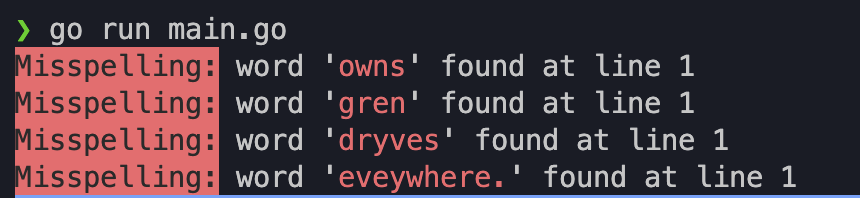

# ACS-4210-make-utility
ACS-4210 Final assignment implementing knowledge of Go to create a utility package.

## Spell Check Utility

This utility package provides a spell check functionality for text files using a dictionary of words. It checks each word in the input text file against a system dictionary and highlights any misspelled words.

### Installation

To use the spell check utility, follow these steps:

1. Install Go if you haven't already. You can download it from the official website: https://golang.org/dl/

2. Install the package by running the following command in your terminal:

```bash
# clone the git repository
git clone https://github.com/paul-fletes/ACS-4210-make-utility
```
3. Navigate to the directory containing the cloned repo.
```bash
cd ACS-4210-make-utility
```
4. Build and install the utility package by running the following command:
```bash
go install
```


### Usage

Once the package is installed, you can use the spell check utility as follows:

1. Ensure you have a text file (`sample-incorrect-text.txt` in this example) containing the text you want to spell check.

2. Run the utility from the command line:
```go
go run main.go
```

3. The utility will read the text file, perform a spell check, and display any misspelled words along with their line numbers.<br>



4. If no misspellings are found, it will display a message indicating that no misspellings were detected.<br>


Feel free to customize the spell checker to suit your specific requirements!

